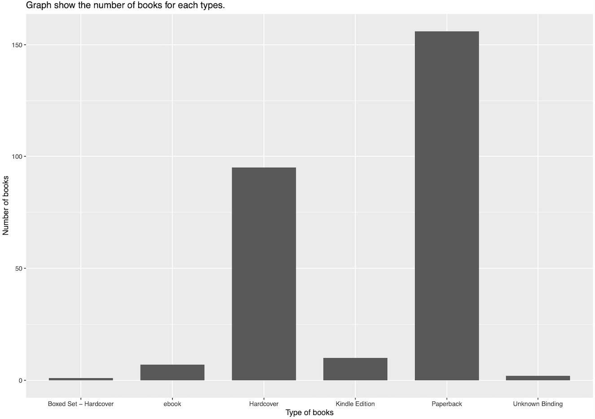
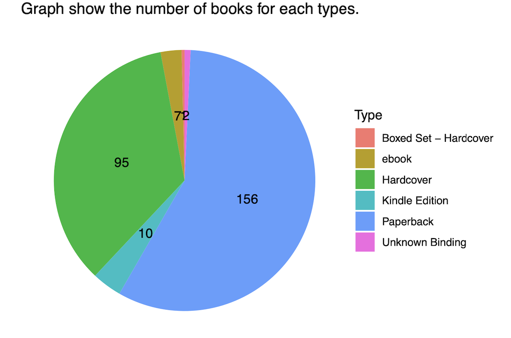
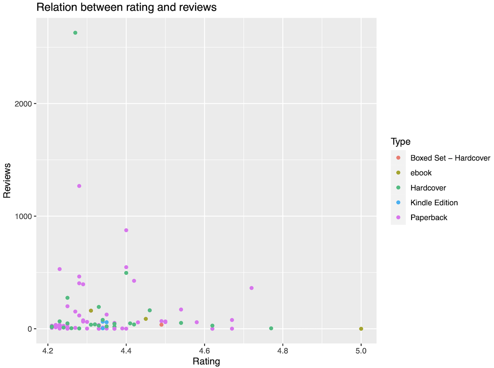

## Part 4: Visualization with GGplot2
### 1. Graph show the number of books for each types.
```
# bar chart
barplot <- books %>% ggplot(aes(x = Type)) + geom_bar(width = 0.7) + 
           ggtitle("Number of books of each types") + 
           xlab("Type of books") + ylab("Number of books") +
           ggtitle("Graph show the number of books for each types")
           
# pie chart
pie <- num_of_books %>% ggplot(aes(x="", y=n, fill=Type)) + geom_col() + 
                 coord_polar(theta = "y") + geom_text(aes(label = n),
                 position = position_stack(vjust = 0.5)) + theme_void() +
                 ggtitle("Graph show the number of books for each types")
```
Result:
<p align="center">
 

</p>


### 2. Graph show relation between rating and reviews which rating has more than equal 4.2.
```
scatter <- books%>% filter(Rating > 4.2) %>%
           ggplot(aes(x=Rating, y=Reviews)) + geom_point(aes(color=Type)) +
           ggtitle("Graph show relation between rating and reviews")

```
Result:
<p align="center">

</p>

---  
[Let's see BI](https://public.tableau.com/views/chart_16352816996460/chart?:language=en-US&:display_count=n&:origin=viz_share_link)
